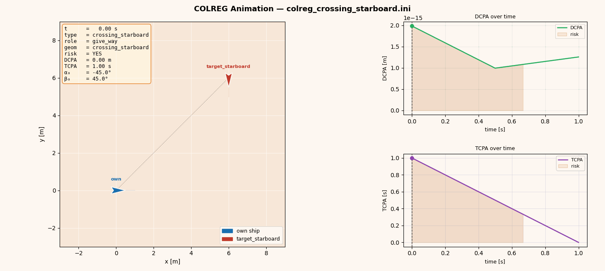
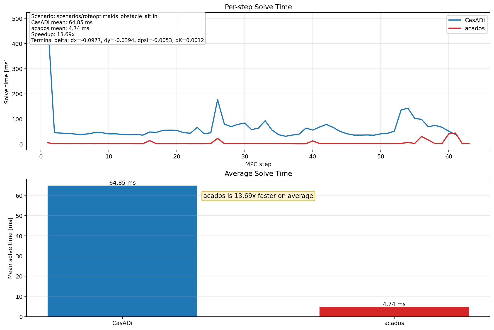

# RotaOptimalds

RotaOptimalds is a curvature-aware model predictive control framework for vessel route optimization. It combines waypoint tracking, obstacle-aware rerouting, and COLREG encounter classification in a scenario-driven workflow with both C++ and Python implementations.


## Why This Repository Is Useful

- solves waypoint-following as a receding-horizon nonlinear MPC problem
- keeps curvature and steering smoothness inside the planning model instead of post-processing them afterward
- supports circular-obstacle detour waypoint generation
- includes preset COLREG encounter scenarios and scan logging
- provides both a C++ / CasADi implementation and a Python port with `casadi` and `acados` backends

## Choose Your Entry Point

- use the Python version if you want the fastest path to a reproducible demo
- use the C++ version if you want the compiled solver workflow around the main implementation

Repository layout:

- `src/`: C++ solver source
- `scenarios/`: C++ scenario files
- `docs/`: example plots and GIFs
- `RotaOptimaldsPy/`: Python port
- `RotaOptimaldsPy/scenarios/`: Python scenarios
- `RotaOptimaldsPy/docs/`: Python plots and benchmark figures

Contribution notes are in [CONTRIBUTING.md](CONTRIBUTING.md).
The project is released under the [GNU GPL v3.0](LICENSE).

## Quick Start

### Python Demo

This is the easiest way to reproduce a result from the repository.

Requirements:

- Python 3.10+
- `pip`
- `casadi`, `numpy`, `matplotlib`
- optional: a working `acados` installation if you want the `acados` backend

Setup:

```bash
cd RotaOptimaldsPy
python3 -m venv .venv
source .venv/bin/activate
pip install -r requirements.txt
```

Run the default scenario:

```bash
python3 main.py
```

Run a specific scenario:

```bash
python3 main.py --solver casadi --scenario scenarios/rotaoptimalds_obstacle_alt.ini
```

Plot the result:

```bash
python3 plot_receding.py \
  --log receding_log.csv \
  --wp waypoints.csv \
  --scenario scenarios/rotaoptimalds_default.ini
```

Python backend details are documented in [RotaOptimaldsPy/README.md](RotaOptimaldsPy/README.md).

### C++ Demo

Requirements:

- CMake 3.16+
- a C++17 compiler
- CasADi C++ headers and library installed locally

Build from the repository root:

```bash
cmake -S . -B build
cmake --build build -j
```

If CMake cannot find CasADi automatically, point it at your CasADi installation:

```bash
cmake -S . -B build -DCASADI_ROOT=/path/to/casadi
cmake --build build -j
```

Run the default scenario:

```bash
./build/rota_optimal_ds --scenario scenarios/rotaoptimalds_default.ini
```

Run the obstacle scenario:

```bash
./build/rota_optimal_ds --scenario scenarios/rotaoptimalds_obstacle.ini
```

Plot the result:

```bash
python3 plot_receding.py \
  --log receding_log.csv \
  --wp waypoints.csv \
  --scenario scenarios/rotaoptimalds_default.ini
```

## Example Outputs

Obstacle-aware route result:


COLREG crossing-starboard animation:



## Main Capabilities

- receding-horizon nonlinear MPC
- waypoint tracking with heading and curvature targets
- clothoid-like spatial propagation with sinc regularization
- curvature bounds and steering-rate limits
- `ds` as an optimization variable
- CSV logging for closed-loop analysis
- static and animated plotting scripts
- COLREG encounter classification with preset scenarios

## COLREG Scenarios

The C++ side includes a COLREG encounter module for category-V style vessel encounters:

- head-on
- crossing starboard
- crossing port
- own-ship overtaking
- target-ship overtaking

The current implementation focuses on:

- encounter classification
- preset scenario generation
- constant-velocity scan logging
- static visualization and GIF generation

Run the active COLREG preset:

```bash
./build/rota_optimal_ds --scenario scenarios/colreg_runner.ini
```

Run a COLREG time scan:

```bash
./build/rota_optimal_ds \
  --scenario scenarios/colreg_runner.ini \
  --colreg-scan \
  --scan-dt 0.5 \
  --scan-steps 80 \
  --out-colreg-log colreg_scan.csv
```

Generate a static plot:

```bash
python3 plot_colreg_scenario.py --scenario scenarios/colreg_runner.ini
```

Generate an animation:

```bash
python3 animate_colreg_scenario.py --scenario scenarios/colreg_runner.ini
```

Preset selection is controlled in [`scenarios/colreg_runner.ini`](scenarios/colreg_runner.ini) via:

```ini
colreg_scenario = head_on
```

Available values:

- `head_on`
- `crossing_starboard`
- `crossing_port`
- `own_ship_overtaking`
- `target_ship_overtaking`

## Modeling View

The planner is built around a curvilinear motion description rather than treating geometry as a post-processing step.

- the predicted state uses `x`, `y`, `psi`, and curvature `K`
- the optimizer chooses curvature command `Kcmd` and spatial increment `ds`
- turning-radius feasibility appears as curvature bounds
- steering smoothness appears as slew-rate limits and cost regularization

Conceptually, this follows the curvilinear relations `dx/ds = cos(chi)`, `dy/ds = sin(chi)`, and `dchi/ds = kappa(s)` and turns them into a repeated MPC solve that is practical for closed-loop route generation.

## Python Benchmark Path

The Python port supports:

- `casadi`: reference Python NLP implementation
- `acados`: faster backend for the same MPC structure

Typical comparison workflow:

```bash
cd RotaOptimaldsPy
python3 main.py --solver casadi --scenario scenarios/rotaoptimalds_obstacle_alt.ini
python3 main.py --solver acados --scenario scenarios/rotaoptimalds_obstacle_alt.ini
python3 compare_solver_speed.py \
  --scenario scenarios/rotaoptimalds_obstacle_alt.ini \
  --save docs/solver_speed_comparison.png \
  --no-show
```

Example benchmark figure:



## Current Scope

This repository already demonstrates the main planning workflow well, but it is still best understood as a research and development codebase rather than a polished end-user application. The strongest audience fit is:

- MPC and optimal control developers
- marine robotics and autonomous navigation researchers
- people comparing `CasADi` and `acados` workflows

## Contributing

If you want outside contributions, create a few GitHub issues labeled `good first issue` and `help wanted`. The repo now includes a contribution guide and issue templates so new contributors have a clear starting point.

## Suggested GitHub Topics

`mpc`, `model-predictive-control`, `casadi`, `acados`, `path-planning`, `collision-avoidance`, `marine-robotics`, `autonomous-systems`, `colreg`, `cpp`, `python`
