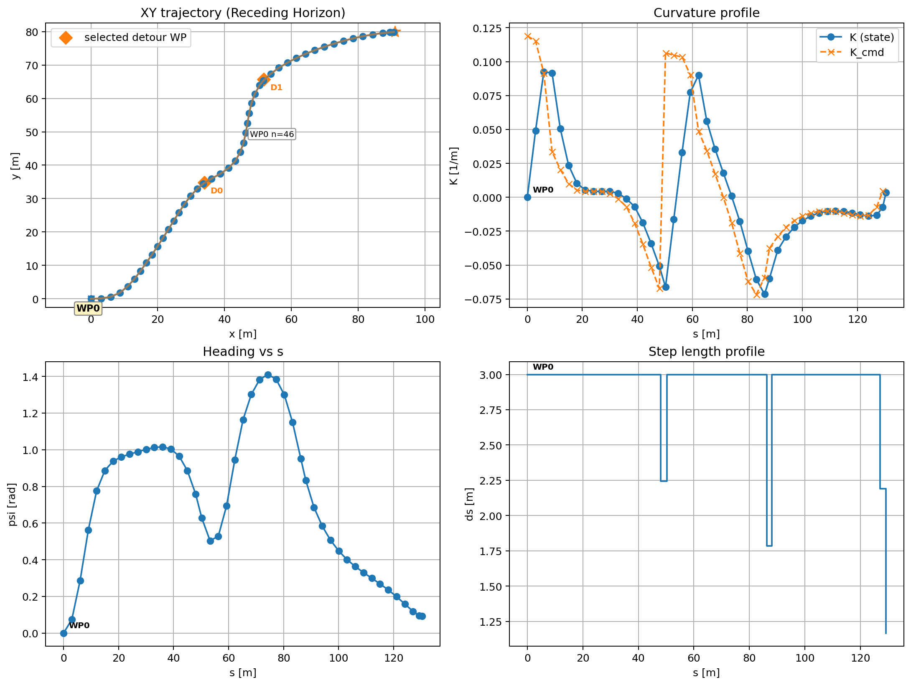
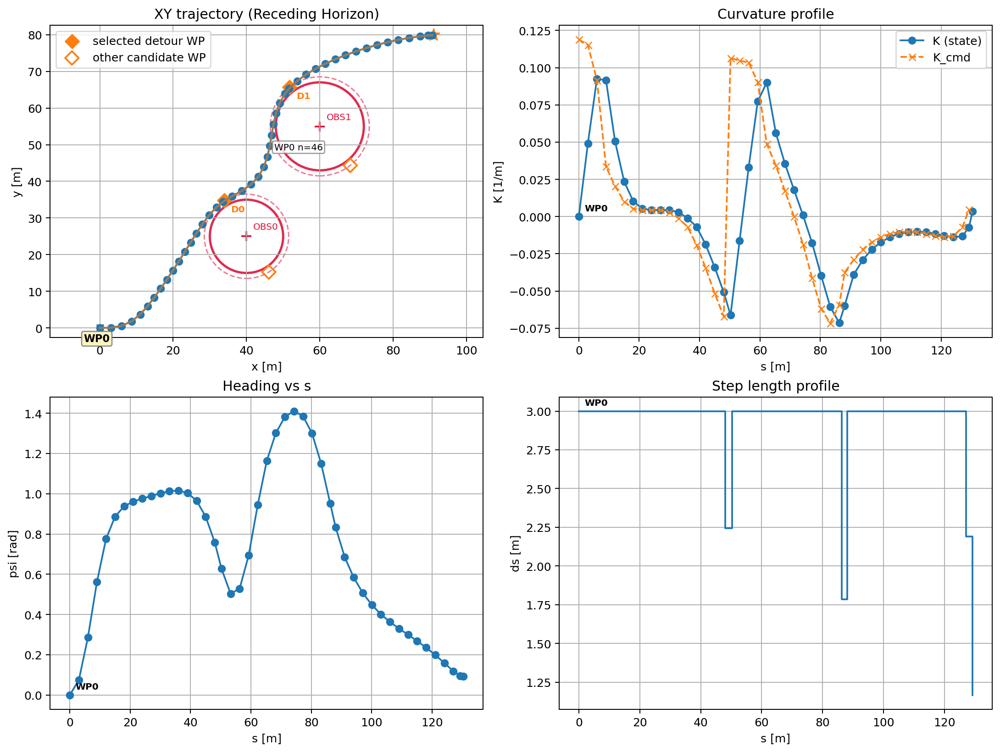

# RotaOptimaldsCpp

C++/CasADi implementation of the `Fresnel/RotaOptimalds.py` workflow.

This project solves a nonlinear receding-horizon route optimization problem for a clothoid-like planar motion model. The controller tracks a sequence of waypoints, regulates heading and curvature, and can generate detour waypoints for circular obstacle avoidance. Results are exported as CSV files and can be visualized with the included Python plotting script.

## What This Project Does

Given an initial state and a list of target waypoints, the solver repeatedly:

1. builds a finite-horizon nonlinear optimization problem,
2. computes a curvature-command and step-length sequence,
3. applies only the first optimized step,
4. shifts the horizon forward and solves again.

This is the standard receding-horizon or Model Predictive Control (MPC) pattern.

The implementation is designed for:

- smooth path generation,
- waypoint-to-waypoint progression,
- curvature-limited motion,
- online re-planning,
- optional obstacle-aware detours,
- reproducible logging and plotting.

## Why MPC Here?

MPC is a good fit for this problem because the controller must optimize motion while respecting geometry and smoothness at the same time.

Main advantages in this project:

- It handles nonlinear motion directly instead of relying on a purely geometric shortcut.
- It optimizes over a horizon, so the controller can trade off current tracking error against future path quality.
- It naturally enforces bounds on curvature and step length.
- It produces smoother trajectories by penalizing curvature-command variation and step-length jumps.
- It re-plans after every applied step, which makes it more robust to modeling error, waypoint changes, and obstacle-triggered detours.
- It supports terminal heading and terminal curvature shaping, which is useful when the path should arrive with a specific orientation or steering state.

Compared with a one-shot open-loop trajectory generator, the receding-horizon structure is more feedback-driven. Compared with a purely local geometric steering rule, it gives more explicit control over smoothness, horizon behavior, and terminal objectives.

## Mathematical Model

The state used by the optimizer is:

```math
\mathbf{x}_k =
\begin{bmatrix}
x_k \\
y_k \\
\psi_k \\
K_k
\end{bmatrix}
```

where:

- $x_k, y_k$ are planar position,
- $\psi_k$ is heading,
- $K_k$ is curvature.

The optimization variables at each horizon step are:

- commanded curvature $K^{cmd}_k$,
- arc-length increment $ds_k$.

The step length is bounded:

```math
ds_{\min} \le ds_k \le ds_{\max}
```

The commanded curvature and actual curvature are also bounded:

```math
|K^{cmd}_k| \le K_{\max}, \qquad |K_k| \le K_{\max}
```

### Curvature Update

Instead of changing curvature instantaneously, the solver uses a rate-limited ramp:

```math
K_{k+1} = K_k + \Delta K_k
```

with

```math
\Delta K_k =
\left(\frac{K_{\max}}{S_{\max}} ds_k\right)
\tanh\left(
\frac{K^{cmd}_k - K_k}
{\left(\frac{K_{\max}}{S_{\max}} ds_k\right) + \varepsilon}
\right)
```

This gives a smooth saturation law for curvature evolution. In practical terms, $S_{\max}$ controls how quickly curvature can change along arc length.

### Clothoid-Like State Propagation

For each horizon step, the motion model integrates the state using a short clothoid-like segment. In simplified continuous form:

```math
\frac{dx}{ds} = \cos \psi, \qquad
\frac{dy}{ds} = \sin \psi, \qquad
\frac{d\psi}{ds} = K
```

Inside the implementation, each step is numerically integrated over small subsegments using CasADi expressions and a sinc-based update for better behavior near zero curvature.

## MPC Objective

The solver minimizes a weighted combination of control effort, smoothness, waypoint attraction, and terminal error.

A simplified form of the objective is:

```math
J =
\sum_{k=0}^{N-1}
\left(
w_K K_k^2
+ w_{Kcmd} (K^{cmd}_k)^2
\right)
+
\sum_{k=1}^{N-1}
\left(
w_{\Delta K}
(K^{cmd}_k - K^{cmd}_{k-1})^2
+ w_{\Delta s}
(ds_k - ds_{k-1})^2
\right)
+
J_{wp}
+
J_{hit}
+
J_{term}
```

The terminal term penalizes final position, heading, and curvature error:

```math
J_{term}
=
\lambda_{term}
\left(
w_{pos}\|\mathbf{p}_N - \mathbf{p}_g\|^2
+ w_{\psi}\,\mathrm{wrap}(\psi_N - \psi_g)^2
+ w_{K_f}(K_N - K_f)^2
\right)
```

The waypoint-attraction term encourages the predicted path to stay near a selected waypoint over the horizon:

```math
J_{wp}
=
w_{wp}
\sum_{k=1}^{N}
\|\mathbf{p}_k - \mathbf{p}_{wp}\|^2
```

There is also an optional intermediate "hit" term applied at a configurable horizon index. This helps shape intermediate waypoint behavior before the final target becomes dominant.

In the code, some position-related terms are normalized by a reference distance between the current state and the goal. That makes weights behave more consistently across short and long maneuvers.

## Receding-Horizon Execution

The project does not optimize the full multi-waypoint route in one giant problem. Instead, it solves one finite-horizon problem repeatedly.

At each control iteration:

1. the active waypoint is selected,
2. an MPC problem is solved for that local target,
3. only the first optimized step is applied,
4. the remaining solution is shifted and reused as a warm start,
5. the process repeats until the waypoint is reached,
6. the controller moves on to the next waypoint.

This design is useful because:

- optimization remains smaller and faster,
- warm-starting improves solve time,
- the controller can react online after every step,
- final and intermediate waypoints can be weighted differently.

## Obstacle Avoidance Strategy

Obstacle avoidance in this repository is implemented as a waypoint-level detour heuristic around circular obstacles.

Important note:

- circular obstacles are not currently enforced as hard nonlinear constraints inside the MPC problem,
- instead, the code detects when the line segment from the current state to the active waypoint intersects an obstacle trigger region,
- then it creates a detour waypoint on the obstacle clearance circle,
- the MPC temporarily tracks that detour waypoint,
- once the detour is reached, control returns to the original waypoint sequence.

This approach is simple and practical when you want obstacle-aware route shaping without making the nonlinear program significantly harder.

## Build

```bash
cmake -S . -B build
cmake --build build -j
```

You can specify the CasADi root directory with `CASADI_ROOT`:

```bash
cmake -S . -B build -DCASADI_ROOT=/path/to/casadi
```

## Run

Run the default configuration:

```bash
./build/rota_optimal_ds
```

Run with an explicit scenario file:

```bash
./build/rota_optimal_ds \
  --scenario scenarios/rotaoptimalds_default.ini \
  --out-log receding_log.csv \
  --out-wp waypoints.csv
```

Show help:

```bash
./build/rota_optimal_ds --help
```

After execution, the program writes:

- `receding_log.csv`
- `waypoints.csv`

If the `ipopt` plugin is not available on your system, the code automatically falls back to `sqpmethod`.

## Windows Setup

### 1. Requirements

- Visual Studio 2022 with Desktop development with C++
- CMake 3.16 or newer
- CasADi C++ distribution containing `include/`, `lib/`, or `bin/`

Recommended folder layout:

```text
RotaOptimaldsCpp/
  third_party/
    casadi/
      include/
      lib/
      bin/
```

### 2. Build (PowerShell)

```powershell
cd C:\path\to\RotaOptimaldsCpp
cmake -S . -B build -G "Visual Studio 17 2022" -A x64 -DCASADI_ROOT="$PWD\\third_party\\casadi"
cmake --build build --config Release
```

### 3. Run

```powershell
.\build\Release\rota_optimal_ds.exe --scenario .\scenarios\rotaoptimalds_default.ini
```

If `ROTA_COPY_CASADI_RUNTIME=ON` is enabled, CMake tries to copy CasADi-related DLLs next to the executable.

### 4. Single-Folder Distribution

```powershell
cmake --install build --config Release --prefix .\dist
```

You can zip the `dist` folder and move it to another Windows machine.
If the target machine is missing `vcruntime`, install the Visual C++ Redistributable.

## Plot

Open an interactive plot window:

```bash
python3 plot_receding.py --log receding_log.csv --wp waypoints.csv --scenario scenarios/rotaoptimalds_obstacle.ini
```

Save the plot directly to an image file without opening a window:

```bash
python3 plot_receding.py \
  --log receding_log.csv \
  --wp waypoints.csv \
  --scenario scenarios/rotaoptimalds_obstacle.ini \
  --save docs/plot_obstacle_example.png \
  --no-show
```

## Example Output

Example CLI output generated from `scenarios/rotaoptimalds_default.ini`:

```text
CasADi solve time: 0.053 s
Terminal [x,y,psi,K] = [-0.216, 0.108, 6.254, 0.030]
Scenario source: scenarios/rotaoptimalds_default.ini
Saved logs: receding_log.csv, waypoints.csv
Active WP index: 3
Average solve time [s]: 0.076
```

Plot generated from `scenarios/rotaoptimalds_default.ini`:



Obstacle-avoidance example generated from `scenarios/rotaoptimalds_obstacle.ini`:



## Scenario File

Default example:

- `scenarios/rotaoptimalds_default.ini`

Supported entries:

- `waypoint = X,Y,psig,Kf,tol,use_Kf,w_wp,hit_scale`
- `obstacle = cx,cy,radius[,enabled]`
- `obstacles_csv = scenarios/obstacles_many.csv`

Obstacle CSV format:

- `cx,cy,radius[,enabled]`
- header is optional

Relevant obstacle-avoidance settings:

- `enable_obstacle_avoidance`
- `obstacle_clearance`
- `obstacle_trigger_margin`
- `obstacle_waypoint_tol`

For empty or optional fields, use `none` or leave them blank.

Example obstacle scenario:

- `scenarios/rotaoptimalds_obstacle.ini`

## Output Files

`receding_log.csv` contains the executed receding-horizon trace, including:

- position,
- heading,
- curvature,
- commanded curvature,
- step length,
- active waypoint index,
- optional detour waypoint information.

`waypoints.csv` stores the waypoint list used for plotting and inspection.

## Implementation Notes

- The NLP is built with `casadi::Opti`.
- IPOPT is the primary nonlinear solver.
- If IPOPT is unavailable, the code falls back to `sqpmethod`.
- Warm-starting is used by shifting the previous solution one step forward.
- The horizon can optionally use blocked decision variables for `Kcmd` and `ds`.
- Terminal curvature can be soft-constrained through the objective or hard-constrained if enabled in the configuration.

## Repository Contents

- `src/rota_optimal_ds.hpp/.cpp`
  Main MPC model, clothoid-like dynamics, solver setup, and receding-horizon loop.
- `src/obstacle_avoidance.hpp/.cpp`
  Circular-obstacle detour waypoint generation.
- `src/scenario_parser.hpp/.cpp`
  INI-style scenario parsing.
- `src/main.cpp`
  CLI entry point.
- `plot_receding.py`
  Plotting utility for CSV outputs.
