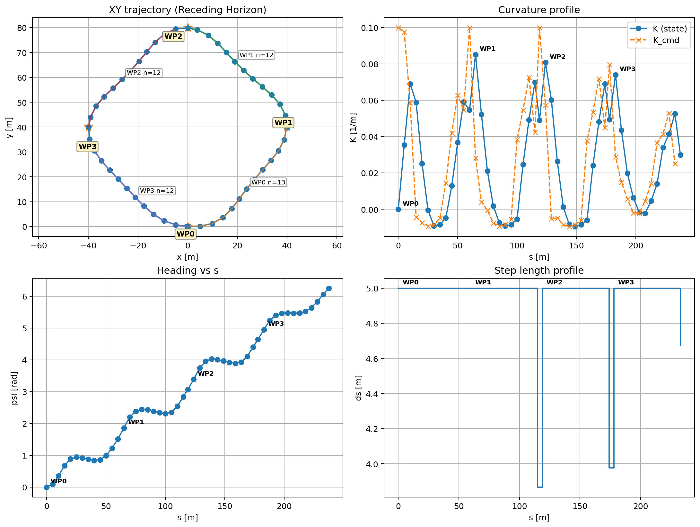
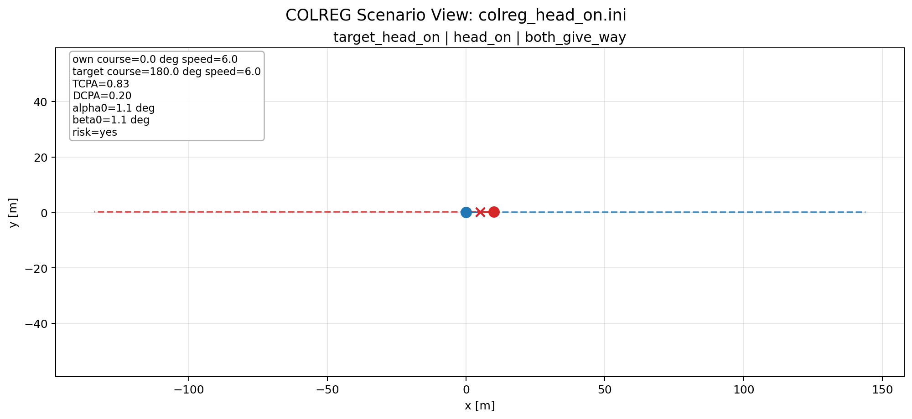
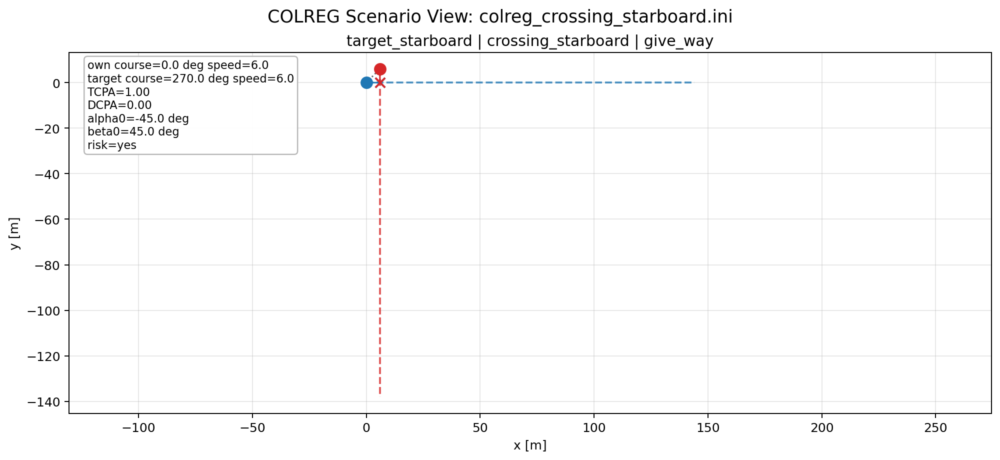
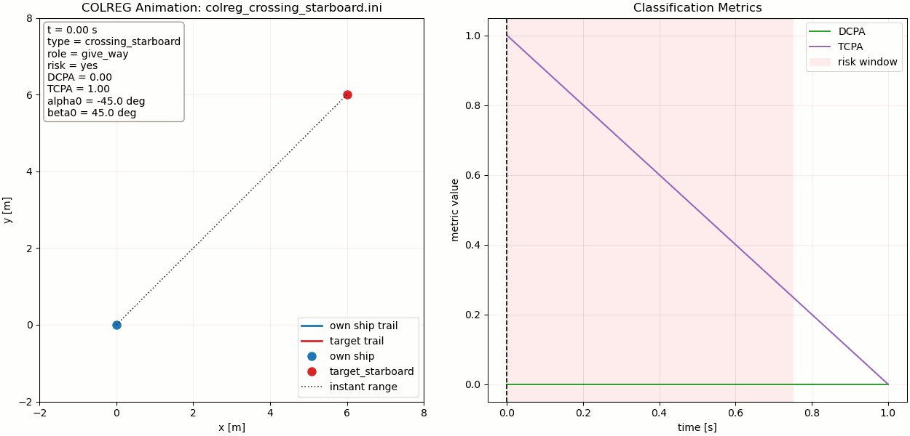
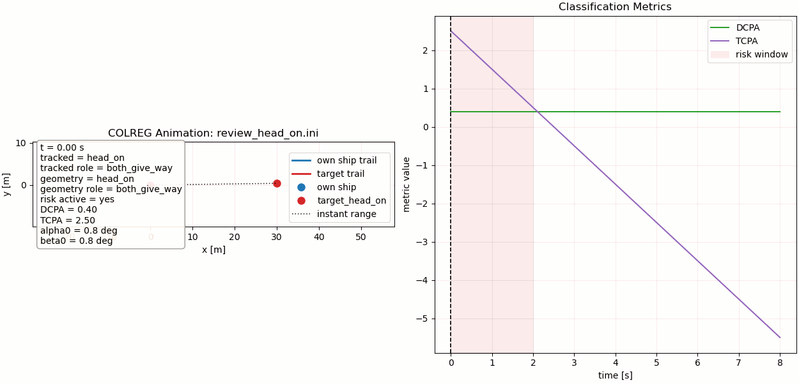

# RotaOptimalds

This repository contains two implementations of the same MPC-based route optimization workflow:

- `src/` and the CMake build: C++ / CasADi implementation
- `RotaOptimaldsPy/`: Python implementation with both `CasADi` and `acados` backends

Both versions use the same overall idea:

- receding-horizon nonlinear MPC
- waypoint tracking with heading and curvature targets
- clothoid-like planar propagation
- optional circular-obstacle detour waypoint generation
- CSV logging and plotting

## Modeling View

The controller is built around a curvilinear geometric representation of motion so that maneuverability limits appear directly inside the planning variables, instead of being pushed afterward to a low-level tracker.

In that view, the path is parameterized by arc length `s` and curvature `kappa(s)`, not by time alone. This makes vessel feasibility much easier to encode: minimum turning radius becomes a curvature bound, and speed affects timing through `ds` rather than changing the geometric meaning of the path itself. This repository adopts that logic in an MPC form that is practical for repeated closed-loop solving.

- The predicted state is carried with `x`, `y`, heading-like angle `psi`, and curvature `K`.
- The optimizer chooses `Kcmd` and the spatial increment `ds`, so path progression is itself part of the optimization.
- Curvature is not treated as a cosmetic smoothing variable; it is part of the internal model and directly determines how the vessel turns from one prediction stage to the next.
- The update from one stage to the next is computed with a clothoid-like, sinc-regularized spatial propagation so that nearly straight and curved motion are handled by one continuous formula.

Conceptually, the model starts from the curvilinear relations `dx/ds = cos(chi)`, `dy/ds = sin(chi)`, and `dchi/ds = kappa(s)`. In this repository, that idea is encapsulated in a control-oriented implementation where `psi` and `K` are propagated explicitly, and the next curvature is obtained through a slew-rate-limited command law. This is the practical bridge between geometric path description and implementable vessel motion prediction.

The cost function is built around that same philosophy:

- terminal and waypoint-related position errors are penalized so the optimizer still reaches the desired route in Cartesian space
- heading and terminal curvature targets are penalized so geometric arrival conditions remain meaningful
- curvature effort `K`, curvature command effort `Kcmd`, and command variation are regularized to avoid aggressive steering profiles
- `ds` smoothness is penalized so spatial progression does not oscillate from one stage to the next

The constraints are also curvilinear in spirit:

- curvature bounds encode turning-radius feasibility
- slew-rate limits on curvature changes encode steering-rate limitations
- lower and upper bounds on `ds`, together with optional `ds` jump limits, keep spatial advancement physically reasonable
- obstacle handling is implemented at the route level through temporary detour waypoints, then refined by the same curvature-aware MPC model

The result is that the optimizer does not merely fit a Cartesian curve through waypoints. It constructs a dynamically consistent motion primitive in which geometry, steering smoothness, and feasible vessel turning behavior are solved together inside the prediction model.

## Repository Layout

- `src/`: C++ solver source
- `scenarios/`: C++ scenario files
- `docs/`: C++ example outputs
- `RotaOptimaldsPy/`: Python port
- `RotaOptimaldsPy/scenarios/`: Python scenario files
- `RotaOptimaldsPy/docs/`: Python example plots

## C++ Version

Build from the repository root:

```bash
cmake -S . -B build
cmake --build build -j
```

Run a C++ scenario:

```bash
./build/rota_optimal_ds --scenario scenarios/rotaoptimalds_default.ini
```

Plot a C++ run with the plotting script:

```bash
python3 RotaOptimaldsPy/plot_receding.py \
  --log receding_log.csv \
  --wp waypoints.csv \
  --scenario scenarios/rotaoptimalds_default.ini
```

Default closed-loop result:



Obstacle-avoidance result:


## COLREG Scenarios

The C++ side now includes a small COLREG encounter module for category-V style vessel encounters:

- head-on
- crossing starboard
- crossing port
- own-ship overtaking
- target-ship overtaking

The encounter classifier is based on the Woerner et al. paper used in this repository workstream:

- Kyle Woerner, Michael R. Benjamin, Michael Novitzky, John J. Leonard, "Quantifying protocol evaluation for autonomous collision avoidance: Toward establishing COLREGS compliance metrics," Autonomous Robots, 43, 967-991, 2019.
- DOI: `10.1007/s10514-018-9765-y`

- initial relative bearing `beta`
- contact angle `alpha`
- CPA / TCPA risk gating
- Rule 13 / 14 / 15 entry geometry

More specifically, the current implementation follows the paper's encounter-entry framing for:

- Rule 13 overtaking geometry
- Rule 14 head-on geometry
- Rule 15 crossing geometry
- use of `alpha`, `beta`, and CPA/TCPA-style risk interpretation

This repository does not yet implement the full scoring/evaluation framework from the paper. The current COLREG module focuses on encounter classification, preset scenario generation, scan logging, and visualization.

The implementation distinguishes two views of an encounter:

- `geometry_type`: the instantaneous geometry at the current time step
- `type`: a stateful tracked encounter family used during scan / animation so the encounter does not disappear immediately at CPA

### Scenario Selection

Use the central preset file:

- [`scenarios/colreg_runner.ini`](scenarios/colreg_runner.ini)

Change only this line:

```ini
colreg_scenario = head_on
```

Available values:

- `head_on`
- `crossing_starboard`
- `crossing_port`
- `own_ship_overtaking`
- `target_ship_overtaking`

The same `.ini` also contains the default COLREG thresholds:

- `colreg_risk_dcpa`
- `colreg_max_tcpa`
- `colreg_alpha_crit_13_deg`
- `colreg_alpha_crit_14_deg`
- `colreg_alpha_crit_15_deg`
- `colreg_overtaking_sector_deg`
- `colreg_crossing_sector_deg`

Important:

- `colreg_scenario` preset mode is mutually exclusive with manual `own_ship` / `target_ship` entries
- `colreg_only = true` runs classification-only scenarios without MPC waypoint tracking

### Terminal Usage

Run the currently selected COLREG preset:

```bash
./build/rota_optimal_ds --scenario scenarios/colreg_runner.ini
```

Run a time scan with constant-velocity propagation:

```bash
./build/rota_optimal_ds \
  --scenario scenarios/colreg_runner.ini \
  --colreg-scan \
  --scan-dt 0.5 \
  --scan-steps 80 \
  --out-colreg-log colreg_scan.csv
```

The scan CSV contains both:

- tracked encounter fields: `type`, `role`
- instantaneous geometry fields: `geometry_type`, `geometry_role`

### Static Visualization

Generate a static COLREG geometry plot:

```bash
python3 plot_colreg_scenario.py --scenario scenarios/colreg_runner.ini
```

Save it to file:

```bash
python3 plot_colreg_scenario.py \
  --scenario scenarios/colreg_runner.ini \
  --save docs/colreg_head_on.png \
  --no-show
```

### Animation

Animate the currently selected preset:

```bash
python3 animate_colreg_scenario.py --scenario scenarios/colreg_runner.ini
```

Slower animation:

```bash
python3 animate_colreg_scenario.py \
  --scenario scenarios/colreg_runner.ini \
  --interval-ms 350 \
  --fps 4
```

Save a GIF:

```bash
python3 animate_colreg_scenario.py \
  --scenario scenarios/colreg_runner.ini \
  --save docs/colreg_runner.gif \
  --no-show
```

By default, the animation shows the approach phase only. Use `--full-window` if you also want the post-CPA separation phase.

### Example Outputs

Head-on static geometry:



Crossing-starboard static geometry:



Crossing-starboard approach animation:



Head-on stateful tracked animation:



## Python Version

The Python-specific guide is here:

[`RotaOptimaldsPy/README.md`](RotaOptimaldsPy/README.md)

The repository also contains a `python-version` branch for Python-side development and integration work. That branch has been used to develop and document:

- the Python `acados` backend alongside the existing Python `CasADi` backend
- trajectory-overlay plots for `CasADi` vs `acados`
- solver-speed comparison tooling and benchmark figures
- Python-specific README updates covering setup, running, plotting, and benchmark reproduction

Quick start:

```bash
python3 RotaOptimaldsPy/main.py --solver casadi --scenario RotaOptimaldsPy/scenarios/rotaoptimalds_default_alt.ini
python3 RotaOptimaldsPy/main.py --solver acados --scenario RotaOptimaldsPy/scenarios/rotaoptimalds_obstacle_alt.ini
```

Python backend benchmark details and figures are documented in:

- [`RotaOptimaldsPy/README.md`](RotaOptimaldsPy/README.md)

That includes:

- `CasADi` vs `acados` trajectory overlay
- per-step solve-time comparison
- commands used to reproduce the benchmark figures

## Notes

- The Python and C++ versions are algorithmically aligned, but small numerical differences may still appear because of runtime and solver details.
- The Python version supports both a `CasADi` backend and an `acados` backend for the same MPC structure.
- In Python, `acados` is expected to reduce solve time relative to `CasADi`, while still following the same scenario and controller structure.
- `ds` is an optimization variable in both versions. It is not explicitly rewarded for staying large, so it can shrink near demanding turns, obstacle detours, or terminal conditions.
- Obstacle avoidance is handled by temporary detour waypoints around circular obstacles rather than hard collision constraints inside the MPC problem.
