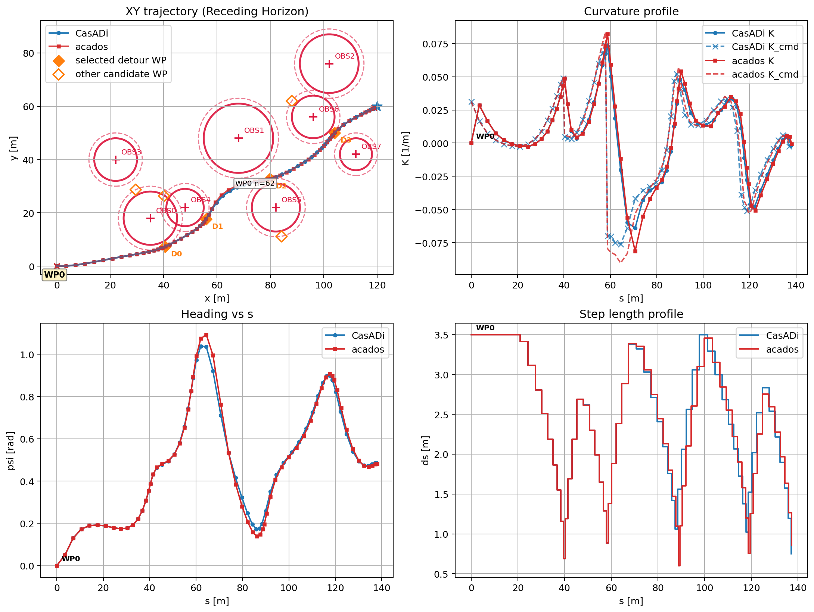

# RotaOptimaldsPy

Python implementation of the `RotaOptimalds` MPC workflow.

This directory mirrors the main route-optimization setup from the C++ project and supports two solver backends:

- `casadi`: reference Python implementation
- `acados`: faster Python backend for the same MPC structure

Both backends use the same scenario format, the same receding-horizon loop, and the same circular-obstacle detour logic.

## What This Includes

- waypoint tracking with heading and curvature targets
- nonlinear receding-horizon MPC in Python
- `ds` as an optimization variable
- circular-obstacle detour waypoint generation
- CSV logging for closed-loop runs
- plotting utilities for trajectories and solver-speed comparison

## Requirements

- Python 3.10+ recommended
- `casadi`, `numpy`, `matplotlib`
- `acados_template` if you want to run the `acados` backend
- a working `acados` installation if you want to solve with `--solver acados`

Install Python dependencies:

```bash
python3 -m venv .venv
source .venv/bin/activate
pip install -r requirements.txt
```

## Running

Run the default scenario:

```bash
python3 main.py
```

Run a specific scenario:

```bash
python3 main.py --scenario scenarios/rotaoptimalds_default.ini
```

Select the solver backend explicitly:

```bash
python3 main.py --solver casadi --scenario scenarios/rotaoptimalds_default.ini
python3 main.py --solver acados --scenario scenarios/rotaoptimalds_obstacle_alt.ini
```

## Outputs

A standard run writes closed-loop outputs such as:

- `receding_log.csv`
- `waypoints.csv`

These can be used directly by the plotting utilities below.

## Plotting

Plot a single run:

```bash
python3 plot_receding.py \
  --log receding_log.csv \
  --wp waypoints.csv \
  --scenario scenarios/rotaoptimalds_default.ini
```

Overlay two runs, for example `CasADi` vs `acados`:

```bash
python3 plot_receding.py \
  --log receding_log_casadi.csv \
  --label CasADi \
  --log-overlay receding_log_acados.csv \
  --overlay-label acados \
  --wp waypoints.csv \
  --scenario scenarios/rotaoptimalds_obstacle_alt.ini \
  --save overlay_receding_plot.png \
  --no-show
```

Plot solver-speed comparison:

```bash
python3 compare_solver_speed.py \
  --scenario scenarios/rotaoptimalds_obstacle_alt.ini \
  --save solver_speed_comparison.png \
  --no-show
```

## Example Outputs

Trajectory overlay for the same scenario solved with `CasADi` and `acados`:



Solver-speed comparison for the same scenario:


## Repository Contents

- `main.py`: CLI entry point
- `rota_optimal_ds.py`: CasADi-based MPC model and receding-horizon loop
- `rota_optimal_ds_acados.py`: `acados` backend for the same MPC formulation
- `scenario_parser.py`: `.ini` scenario parser
- `obstacle_avoidance.py`: obstacle trigger and detour-waypoint selection
- `plot_receding.py`: trajectory plotting utility
- `compare_solver_speed.py`: CasADi vs `acados` solve-time comparison
- `scenarios/`: example Python scenarios

## Notes

- This port stays intentionally close to the C++ behavior, including several solver-side design choices and warm-start conventions.
- `casadi` and `acados` solve the same MPC structure, but small closed-loop differences can still appear because of solver internals, line search, termination criteria, and numerical conditioning.
- The `acados` backend is expected to be faster, but it requires a valid local `acados` setup in addition to the Python package.

## CasADi vs acados

- `casadi` is the easier reference path when you want a direct Python NLP implementation and simpler dependency setup.
- `acados` is the faster path when solve time matters, especially in repeated closed-loop MPC runs.
- Both backends use the same scenario semantics and target the same controller structure, but they do not guarantee bitwise-identical trajectories or iteration histories.
- Small differences in terminal state, control sequence, step count, or obstacle-detour timing are expected when solver settings or numerical conditioning differ.
